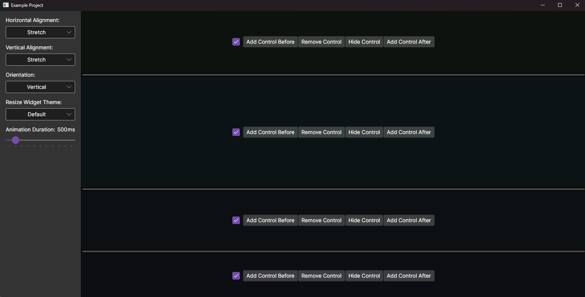

# Laminar.Avalonia.AdjustableStackPanel

SelectAndMove is a lightweight, modular Avalonia control for selecting and moving controls. 

[See source code for this example](examples/Laminar.Avalonia.AdjustableStackPanel.Example/MainWindow.axaml)

## Implementation Details
The core AdjustableStackPanel class inherits from the base Avalonia StackPanel class to gain all of the tab controls, but the key difference is every control added gets a ResizeWidget control attached to it, which raise resize events.

### Resize Behaviour

The look and behaviour of the resizing is controlled by a few key classes whos behaviours can be overridden:
- ResizeWidget is a TemplatedControl whos look can be overridden. Certain "resize zones" are marked with by naming certain elements, hovering over a resize zone will put it in a ResizerMode.
- ResizerMode define the behaviour of each resize zone, specifying which ResizeMethod to use before and after the resizer. Default ResizeMethods are "Cascade" which tries to take space from the closest control, and "Scale" which scales all controls, but more can be defined.
- ResizeGesture defines the overall actions which can happen when the user moves a resizer. For example, with the ResizerMode "Default" and the ResizerModifier "Move", two resizers will be moved such that one control is moved with the Cascade method before and after the control. The user can define their own ResizeGesture dictionary.

### AdjustableStackPanel Layout Behaviour

The behaviour of the panel itself is dynamically determined by the its alignment and orientation. The layout pass is executed with the following method:
- In the Measure pass, it will be measured similarly to a StackPanel. The difference being in Stretch mode it will only return the total DesiredSize of the controls, instead of the Resizer defined size. This is in convention with Avalonia.
- Before the end of the Measure pass, queued up resize gestures are executed, and the Measured size is adjusted accordingly.
- In the Arrange pass, the control is given the actual size it should take up. In the Stretch alignment, a Scale resize operation is carried out to ensure it takes up all the given space.
- The controls and their resizers are then arranged top to bottom.

## Resources
[GitHub Repository](https://github.com/Adam-Wilkinson/Laminar.Avalonia.AdjustableStackPanel)

[Nuget Package](https://www.nuget.org/packages/Laminar.Avalonia.AdjustableStackPanel/1.0.0)

## License

AdjustableStackPanel is licensed under the [MIT license](LICENSE.TXT)